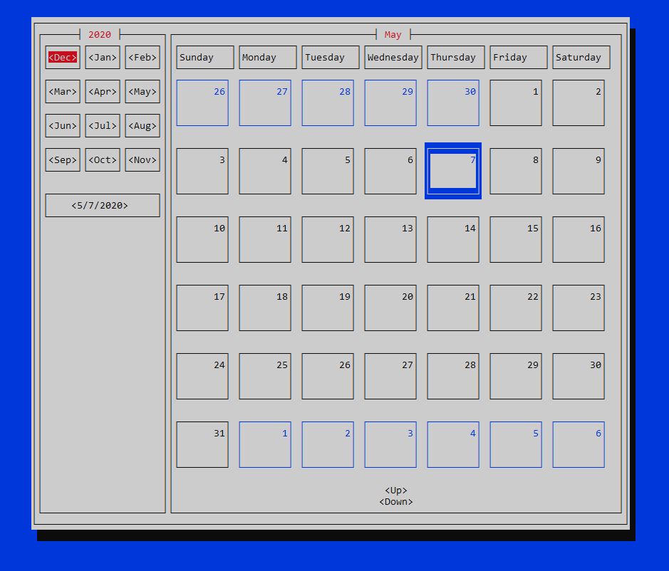
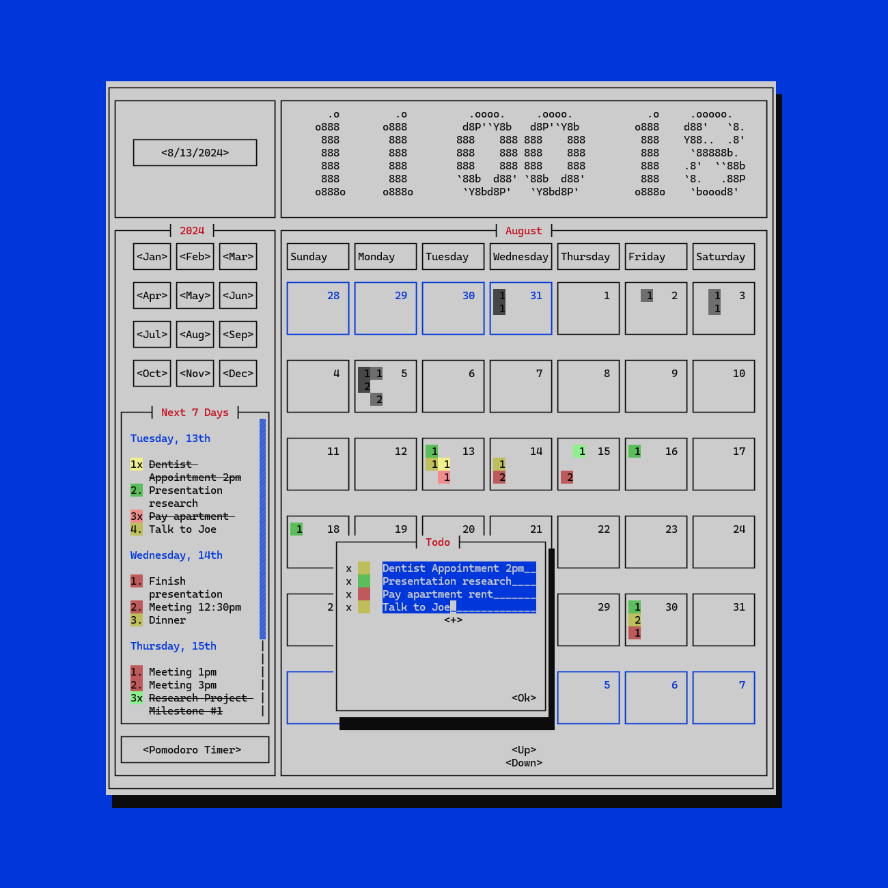

# RustCal
[](./LICENSE)
[](https://github.com/egol/RustCal)


TUI calendar app written in rust
#### Built with [Cursive](https://github.com/gyscos/cursive)
 
<p align="center">
  
  
</p>

## Building the project

 - ### [Available backends](https://github.com/gyscos/cursive/wiki/Backends)

    - `ncurses-backend` _(default)_: uses the [ncurses-rs] library directly. Currently only compatible on Linux and macOS. 
    - `pancurses-backend`: uses the [pancurses] library, which forwards calls to [ncurses-rs] on Linux/macOS or [pdcurses-sys] on Windows. 
    - `termion-backend`: uses the pure-rust [termion] library. Works on Linux, macOS, and Redox.
    - `crossterm-backend`: uses the pure-rust [crossterm] library. Works crossplatform, even for windows systems down to version 7.
    - `blt-backend`: uses the cross-platform [BearLibTerminal.rs] binding. Works on Linux and Windows.
 - ### Instructions
    1. clone the git repository
    2. modify the toml file line pictured below with the backend you desire
    ```[dependencies.cursive]
   version = "0.14"
   default-features = false
   features = ["<Your backend here>"]
   ```
    3. run the command `cargo run` to launch the application

## Features
 * Month by Month displaying
 * Basic Todo List functionality
 * Flexible cross-platform TUI library that supports Linux, Windows and Mac
 * Basic saving functionality through a single accssesible json file (press 'k' to save)
## TODO
 - Impliment a weather forecast display using a user provided API key
 - An ascii art digital clock 
 - Todo-list event naming and ability to set them on specific time
 - Custom UI theme (dark mode)
 - Complete code rewrite
 - Ability to grab events from other calendar applications
 - Windows notifications for events
 - Companion phone app
